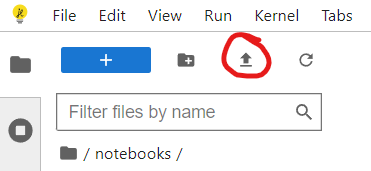
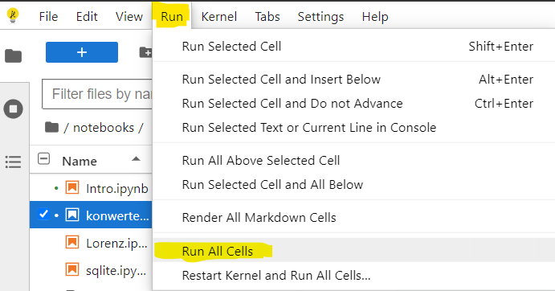
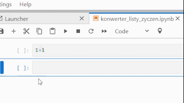

# Sanakan-notebook
[](https://jupyter.org/try)
[](https://mybinder.org/v2/gh/MarcinJaracz/Sanakan-notebooks.git/main?urlpath=https%3A%2F%2Fgithub.com%2FMarcinJahttps%3A%2F%2Fgithub.com%2FMarcinJaracz%2FSanakan-notebooks%2Fblob%2Fmain%2Fkonwerter_listy_zyczen.ipynb) 
[](https://shields.io/)


## [Opcja 1. Uruchom Notebook online](https://mybinder.org/v2/gh/MarcinJaracz/Sanakan-notebooks.git/main?urlpath=https%3A%2F%2Fgithub.com%2FMarcinJahttps%3A%2F%2Fgithub.com%2FMarcinJaracz%2FSanakan-notebooks%2Fblob%2Fmain%2Fkonwerter_listy_zyczen.ipynb) poprzez Binder.

Instalowanie niezbędnych bibliotek z pliku requirements.txt
```
pip install -r requirements.txt
```
## Opcja 2. "łatwiejsza"
1. Pobierz plik `konwerter_listy_zyczen.ipynb`.
2. Wejdź na https://jupyter.org/try-jupyter/lab/ 
3. po lewej stronie dodaj oba potrzebne pliki, tj. `konwerter_listy_zyczen.ipynb` oraz `tldr.txt` za pomocą tego przycisku => 
4. Teraz pozostało już tylko uruchomiić program zgodnie z przeznaczeniem.
 Jeżeli nie jest ci znajome Środowisko Anacony ani JupyterNotebook możesz spróbowac uruchomić cały program za jednym kliknięciem. W tym celu wybierz tą opcję => 

Aby uruchomić pojedyńczą komórkę programu należy ją mieć zaznaczoną, kliknąć `Alt`+`Enter` lub `Shift`+`Enter` by wykonać polecenie.
Alternatywnie użyj przycisku tak jak poniżej =>



____________________________________________________________________________
Zeszyt `konwerter_listy_zyczen.ipynb` zawiera szereg instrukcji, które pomogą Ci zrozumieć działanie tego probramu. Poradzisz sobie.\
\
Powodzenia,\
JarMar